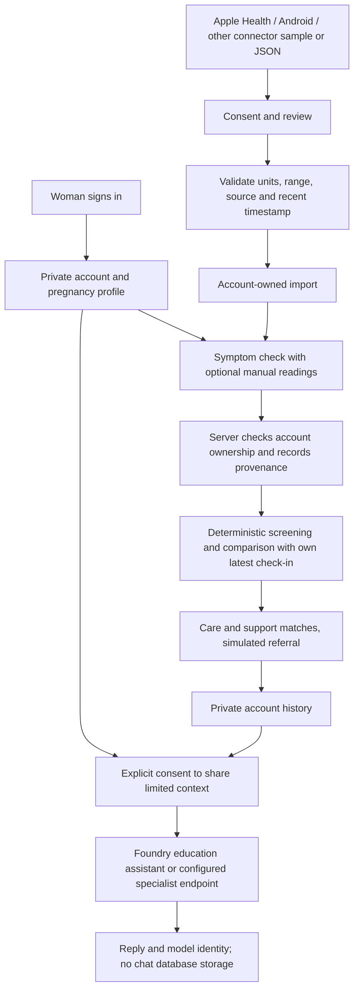

# Personal experience — 21 September 2026

The local preview now has account registration/sign-in, a personal pregnancy profile,
private assessment history, optional reviewed health-app imports, public learning
cards and downloadable education, and consent-gated Foundry chat.

## Demonstrate the flow

1. Open http://127.0.0.1:8000 and create an account using fictional details.
2. Save a name, pregnancy stage and any optional details in My profile.
3. Check symptoms without entering any vital signs. Unknown values stay unknown.
4. Open Health apps, choose Apple Health, Android Health Connect or Other,
   enable optional imports, preview fictional readings and explicitly review them.
5. Import, then choose **Use in next check-in**. The backend attaches readings
   only to the signed-in account. Manual values take priority over imported values.
6. Review **Where this check-in’s data came from** in the result. It records
   source, provider, unit, measurement time and import identifier.
7. Sign out and sign back in: the account's history persists. Another account
   has its own profile, imports and check-ins.
8. Ask Mama Link a question after consenting to the limited cloud context.
   Read its backend/model label. Emergency and medicine questions have local
   guidance paths that do not depend on the model being online.
9. Open Learn without signing in. Download the small, self-contained HTML guide;
   it reads offline without scripts, fonts or network requests. External source
   links still need internet. Read-aloud uses the browser's installed voices.

## Data flow



Names, usernames and passwords are excluded from the automatically constructed
cloud context. The question, recent conversation, pregnancy stage, age, weeks/days,
medicines, allergies and up to three check-ins are sent only after the chat consent.
Users can themselves type identifiers into a question; the preview does not promise
automatic de-identification of free text. Raw assessment notes are neither persisted
nor interpreted. Readings never automatically trigger external notifications.

## Accounts and administrators

Passwords are salted and hashed with scrypt. Server-side sessions expire after
12 hours and are revoked on sign-out. API ownership checks protect records and
imports. Registration always creates an ordinary account. Cases, fixture-based
assessments, the synthetic map and evaluation require the administrator role on
the server, not just hidden navigation. No built-in admin password exists.

Promote a deliberately chosen existing local account:

```powershell
.\.venv\Scripts\python.exe scripts/manage_admin.py USERNAME
```

This is local prototype authentication. Public deployment still needs HTTPS,
managed identity/recovery, operational controls, a privacy/retention policy and
clinical review. Keep using fictional details. Existing anonymous demo records
are left intact, but are not assigned to newly created accounts.

## Apple, Android and other connectors

**Live phone syncing is not implemented.** The web app provides provider choices,
an actual validated JSON import endpoint and a clearly labelled sample flow. It
does not pretend to request native OS permissions.

Apple Health needs a signed iOS app with HealthKit entitlements and read permission
for each metric. Android Health Connect needs an Android app, availability checks
and per-type permissions. These cannot be granted by this desktop browser.
The remaining mobile work is to collect authorised samples, normalise them into
the import contract and submit after user review to an authenticated HTTPS service.
Background sync, native builds, platform approval and provider OAuth are pending.

Official references:
- https://developer.apple.com/documentation/healthkit/setting-up-healthkit
- https://developer.android.com/health-and-fitness/health-connect/get-started

`POST /api/device/import` accepts one to four measurements, timezone-aware timestamps
from the last 24 hours, units mmHg/bpm/C, a source (`sample_device` or
`health_app_export`), provider (`apple_health`, `android_health_connect`, `other`),
device name, and explicit review/synthetic confirmations. Duplicate metrics,
wrong units, stale/future readings and cross-account import identifiers are rejected.
Samples are not an Apple XML export or Android SDK client. Other providers must
normalise exports to this documented JSON contract. Provider names in imported
files are user-supplied provenance, not cryptographically verified device identity.

Disabling imports deletes unused imported batches. Existing assessment snapshots
retain their measurement provenance until the woman clears her assessment history.

## Foundry and medical-model status

The existing resource was checked: its deployed model is **gpt-4.1-mini**.
A live fictional question returned a response on 21 September 2026. This is a
general model constrained as a maternal-health education assistant, **not a
medically trained or clinically validated model**. The interface states this.

`MAMA_HEALTH_MODEL`, `MAMA_HEALTH_ENDPOINT` and `MAMA_HEALTH_API_KEY` enable a separate
Azure Model Inference-compatible chat endpoint. That adapter is configuration-only
until an appropriate deployment is provisioned and tested. It does not silently
fall back to the general model after a configured specialist endpoint fails.
Med42 is a candidate for evaluation; no Med42 deployment was created. A managed
compute `/score` endpoint may need its own adapter; do not assume compatibility.

Sources used for model selection and adapter shape:
- https://huggingface.co/m42-health/Llama3-Med42-8B
- https://www.microsoft.com/en-us/microsoft-cloud/blog/healthcare/2024/10/10/unlocking-next-generation-ai-capabilities-with-healthcare-ai-models/
- https://learn.microsoft.com/en-us/rest/api/microsoftfoundry/model-inference/get-chat-completions/get-chat-completions?view=rest-microsoftfoundry-model-inference-2024-05-01-preview

Chat includes a bounded recent conversation, supplied source passages and the
woman's own context. Source links are reference material supplied to the model,
not proof that every generated sentence has been independently verified. Medicine
guidance asks for qualified review rather than selecting medicines or dosages.
Clinical content and multilingual quality still need professional evaluation.

## Verification

Automated tests cover account isolation, sign-out/sign-in persistence, admin route
denials, missing readings, import consent, ownership, units, timestamps, duplicate
metrics, manual precedence, revocation, local medication/emergency responses,
no cloud request without consent, and current-account-only chat context. Existing
screening, referral and Foundry-tool-boundary regressions are retained.

The cloud smoke check uses only fictional information. No real referral, SMS,
facility alert, native phone sync or medical-model deployment occurs in these tests.
